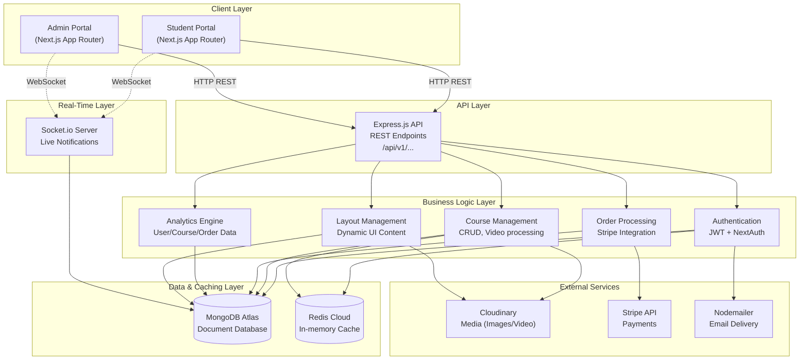
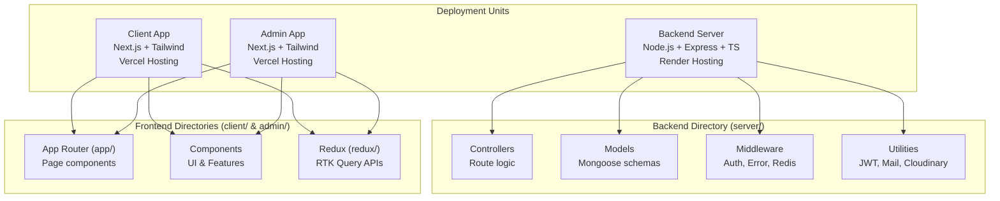

# LearnEx | Learning Management System
## Executive Summary

**LearnEx** is a modern, production-grade e-learning platform built with a powerful full-stack JavaScript architecture. The platform connects students with high-quality educational content through a seamless, interactive, and highly responsive digital ecosystem.

### Key Value Propositions:
- **Premium Learning Experience**: A sleek, glassmorphic UI designed to provide a distraction-free and engaging learning environment.
- **Dynamic Content Management**: A robust admin portal for creating courses, managing users, and customizing the platform's appearance in real-time.
- **Real-Time Interactions**: Socket.io-powered notifications and live updates keep users and admins connected.
- **Enterprise-Grade Architecture**: Scalable, cloud-native infrastructure utilizing Redis caching, MongoDB, and Next.js App Router for optimal performance.

---

## Project Goals & Objectives

### Primary Objectives
1. **Enable Seamless Course Consumption**: Build an intuitive platform allowing students to browse, purchase, and consume educational content effortlessly.
2. **Comprehensive Course Creation**: Provide educators and administrators with a powerful, stepper-based course creation wizard supporting multimedia content (Cloudinary).
3. **Advanced Analytics & Tracking**: Implement detailed visual analytics (Chart.js) for user growth, course enrollments, and revenue generation.
4. **Ensure Secure Transactions**: Integrate Stripe for seamless, PCI-compliant course purchases.
5. **Real-time Platform Customization**: Allow admins to update Hero sections, FAQs, and Categories dynamically without touching the codebase.

---

## System Architecture

### High-Level System Architecture

---

## Database Design Architecture

### Key Collections

| Collection | Purpose | Key Fields |
|-----------|---------|-----------|
| **Users** | Student & Admin accounts | name, email, password, role, courses, avatar |
| **Courses** | Educational content | name, description, price, videoUrl, reviews, syllabus |
| **Orders** | Purchase transactions | userId, courseId, payment_info |
| **Notifications** | Real-time alerts | title, message, status, userId |
| **Layouts** | Dynamic platform content | type (FAQ, Categories, Banner), content |

---

## Project Structure Overview

The project is organized into three main deployment units, each serving distinct responsibilities:

---

## Core Features & Capabilities

### Student Experience (Client)
- **Authentication**: Email/Password, Google, and GitHub login (NextAuth & JWT).
- **Course Discovery**: Browse, search, and filter available courses by categories.
- **Course Purchasing**: Secure checkout using Stripe integration.
- **Learning Interface**: Dedicated video player and course content consumption UI.
- **Reviews & Q&A**: Leave course reviews and ask questions directly to instructors.

### Platform Management (Admin)
- **Premium Dashboard**: Sleek, glassmorphic UI with dark/light mode support.
- **Advanced Analytics**: Visual charts (Chart.js) tracking 12-month trends for Users, Orders, and Courses.
- **Course Builder**: Multi-step wizard to create comprehensive courses with prerequisites, benefits, and video content.
- **User & Team Management**: View all users, manage roles, and handle team permissions.
- **Dynamic Customization**: Edit the client-facing Hero Banner, FAQ section, and Course Categories directly from the admin panel.
- **Live Notifications**: A notification bell with unread badges powered by Socket.io, tracking new orders and user registrations.

### Backend Infrastructure (Server)
- **Redis Caching**: Highly optimized API responses via Redis session caching and data caching.
- **Cloudinary Integration**: Automated uploading, optimization, and delivery of user avatars and course thumbnails.
- **Security**: JWT tokens in HTTP-only cross-origin cookies, bcrypt password hashing, and strict TypeScript compilation.
- **Error Handling**: Centralized `catchAsyncError` wrapper ensuring zero unhandled promise rejections.

---

## Technology Stack

### Frontend (Client & Admin)
| Technology | Purpose |
|-----------|---------|
| **Next.js 16+** | React framework with App Router |
| **Tailwind CSS 4** | Utility-first styling and glassmorphic design |
| **Redux Toolkit** | State management and RTK Query for data fetching |
| **Chart.js & react-chartjs-2** | Visual analytics and data representation |
| **Formik & Yup** | Form state management and schema validation |
| **NextAuth** | Social authentication (Google/GitHub) |
| **React Hot Toast** | Premium toast notifications |

### Backend (Server)
| Technology | Purpose |
|-----------|---------|
| **Node.js & Express 5** | Server runtime and web framework |
| **TypeScript** | Static typing for robust code |
| **MongoDB & Mongoose 9** | NoSQL database and ODM |
| **Redis (ioredis)** | High-performance in-memory caching |
| **Socket.io 4** | Real-time bi-directional communication |
| **Stripe SDK** | Secure payment processing |
| **Cloudinary SDK** | Media management |
| **JSON Web Tokens** | Stateless authentication |

---

## Deployment Configuration

- **Client App**: Deployed on Vercel (`npm run build`).
- **Admin App**: Deployed on Vercel (`npm run build`).
- **Backend Server**: Deployed on Render.
  - **Build Command**: `npm install && npm run build` (compiles TS via `tsc`).
  - **Start Command**: `npm start` (runs `node dist/server.js`).

---

## Development Team

**Project Lead**: Sheraz Hussain  
**Architecture**: Full-stack Next.js/Node.js (MERN stack with Redis)  
**Last Updated**: August 2026
